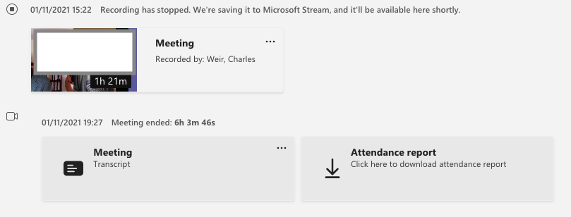
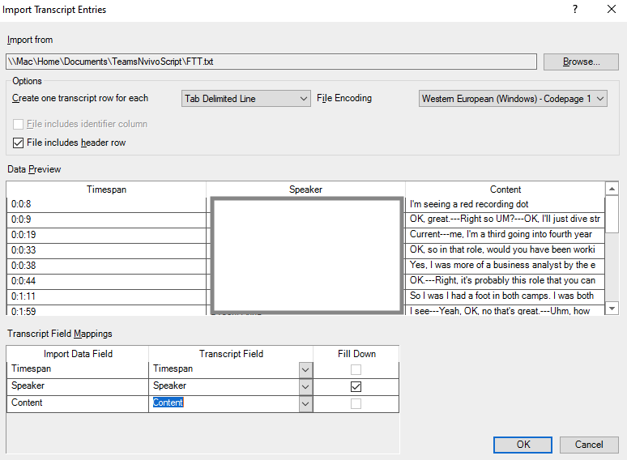

# Convert Teams Transcripts to NVivo

This utility converts a Microsoft Teams transcript to the [NVivo format](https://help-nv.qsrinternational.com/12/win/v12.1.108-d3ea61/Content/files/import-audio-video-transcripts.htm) so as to make coding and analysis as easy as possible.

## Introduction

[Microsoft Teams](https://twitter.com/MicrosoftTeams) does surprisingly good automated transcription, and these transcripts can be downloaded along with the corresponding recordings. 

This utility allows you to use these transcripts with [NVivo](https://www.qsrinternational.com/nvivo-qualitative-data-analysis-software/home), the popular qualitative analysis software. It's written in HTML and JavaScript so only requires your browser to run.

 NVivo doesn't allow you to code two transcript items at once, so this combines as many items by a single speaker as possible. And Teams transcription times aren't always aligned with the start of the recording, so this implements a 'time shift'.

## Instructions

These instructions are importing to Windows NVivo 12. Mac users may need to adjust them for your own situation. 

* Record your interview in Teams, creating a transcript 
* The video and transcript appear as entries in due course in the chat (**The transcript may take several hours**)
* 
* On the video, click *...* and *Open in Microsoft Stream.* Scroll down to Details tab, and click *... Download video*.
* Optionally, if you want audio only, click on the downloaded video file to open in Quicktime; use *File - Export As - Audio Only* to get an m4a file
* import the M4A audio or MP4 video into NVivo - see [here](https://help-nv.qsrinternational.com/12/win/v12.1.108-d3ea61/Content/files/audio-and-videos.htm)

* On the transcript in the chat, click *... Download as .vtt*

* Use the [converter page here](converter.html) to convert that .vtt file to NVivo transcript format (whose file extension is .txt):
    
* Import that transcript into NVivo by opening the recording and clicking *Edit*, then *Import rows*. Use the options *One transcript row for each tab-delimited line*, *File includes header row*, and manually set the obvious field mappings as shown below (details blanked for privacy). There's more information [here](https://help-nv.qsrinternational.com/12/win/v12.1.108-d3ea61/Content/files/import-audio-video-transcripts.htm#Import_a_transcript):

* 

* Click OK to do the import. If NVivo pops up a dialog with *The timespan of one or more entries...*, click OK

* You'll see the transcript entries have '---' internally instead of paragraph endings (NVivo doesn't have a text transcript input format that supports both speaker identification and multiple paragraphs in a single transcript 'line'). Use *Edit tab - Find & Select - Replace* to replace instances of "---" with "^p^p" (a blank line): 

* 

* Click *Replace all*. It takes a while and looks a bit odd, but it works. Click OK to the *Replaced Instances* dialog and you're done. 

## Changing timestamps

Sometimes (usually?) the timings on the transcript are a few seconds different from those in the recording. NVivo doesn't seem to have an easy way to correct that, so we've implemented one in the script here. To make the correction:

* Delete the transcript entries in NVivo (either *Select All - Right click Delete*; or just *Undo* a couple of times).
* Change the timings in the transcript using the timeshift parameter. 
* And reload the transcript as above. Experiment with different values of the timeshift until it's close enough for your needs (-10 is typical).

